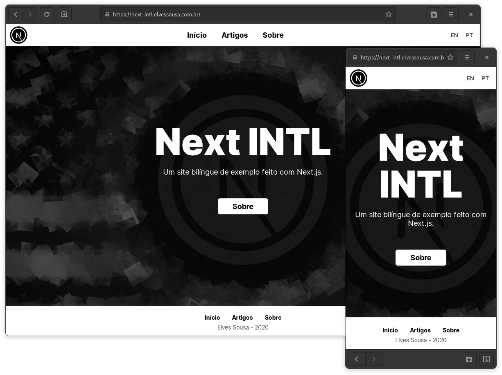

    
    <h1 align="center" style="margin: 0;">
        
        Next INTL
        
    </h1>

     

## About

Site made to showcase the creation of a bilingual website using Next.js. The tutorial is in an article on my blog. Feel free to view
the source code, fork it, or even use it in your projects.

---

## Packages used

This project was developed using the packages below:

- gray-matter
- remark
- remark-html

These are for parsing markdown as HTML.

---

## How to contribute

- Fork this repo
- Create a branch with your feature: `git checkout -b my-feature`;
- Commit your modifications: `git commit -m 'feat: My new feature'`;
- Push it to your branch: `git push origin my-feature`.
